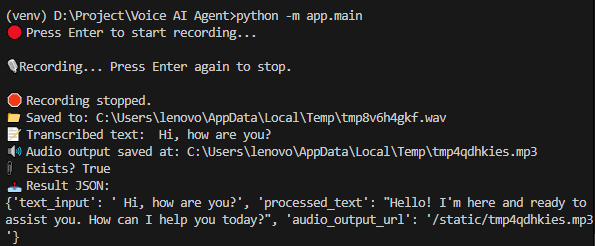

# Voice AI Agent

A voice-based AI assistant that processes voice input, generates contextual responses using RAG, and provides audio output.

## Features

- Voice recording and transcription using OpenAI-Whisper
- Context retrieval using RAG
- LLM processing for intelligent responses
- Text-to-speech conversion

## Setup Instructions

1. Clone the repository:
   ```
   git clone https://github.com/yourusername/voice-ai-agent.git
   cd voice-ai-agent 
   ```

2. Create and activate a virtual environment:
    ```
    python -m venv venv
    source venv/bin/activate (Windows)
    ```

3. Install dependencies:
    ```
    pip install -r requirements.txt
    ```

4. Install ffmpeg (required for audio processing) and add to path:
    > On Windows: Download from https://www.gyan.dev/ffmpeg/builds/ choose the ffmpeg-git-full.7z
    >Extract the ZIP file to a permanent location (e.g., C:\Program Files\ffmpeg)
    >Add to PATH:
        Open Start Menu and search for "Edit the system environment variables"

        Click "Environment Variables"

        Under "System variables", find and select "Path", then click "Edit"

        Click "New" and add the path to the bin folder (e.g., C:\Program Files\ffmpeg\bin)
    >Verify installation:
        Open a new Command Prompt (existing ones won't see the new PATH) and run
        ```
        ffmpeg -version
        ```
        You should see version information


5. Set up environment variables:
    Create a .env file inside inside repository to add api keys (OpenAI, etc.)
    Edit the .env file to configure:

        OpenAI API key
        Audio recording parameters (eg.LLM_MODEL, TTS_MODEL)
        Model preferences (eg.AUDIO_OUTPUT_FOLDER, AUDIO_UPLOAD_FOLDER)

        All values except API keys are defaulted inside app/utils/config.py


    eg. folder structure:
    ```
                voice-ai-agent/
            ├── app/
            │   ├── stt/
            │   │   ├── whisper_stt.py
            │   │   └── record_script.py
            │   ├── tts/
            │   │   └── tts_service.py
            │   ├── llm/
            │   │   └── llm_processor.py
            │   ├── rag/
            │   │   └── retriever.py
            │   └── main.py
            ├── docs/
            │   └── example_content.pdf  # Sample document for RAG
            ├── static/
            │   └── (generated audio files)
            ├── .env
            ├── requirements.txt
            ├── README.md
    ```
    

6. Open terminal in your root folder
    Running the CLI version:
    ```
    python -m app.main
    ```
    Follow the on-screen prompts:

    Press Enter to start recording

    Speak your query

    Press Enter again to stop recording

    The system will process your input and generate a response

    example response:
    

    Sample Input/Output

        Input (spoken):

            "Hi, how are you?"

        Output:

            Transcribed text: "Hi, how are you?"

            Processed response: "Hello! I'm here and ready to assist you. How can I help you today?"

            Audio file generated with the response


